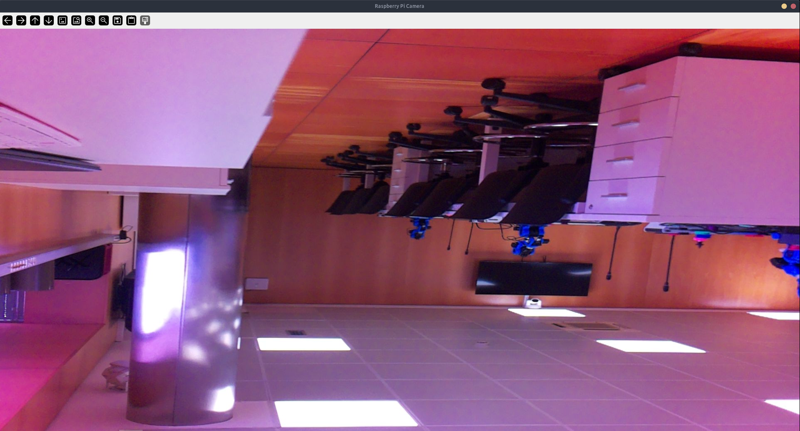
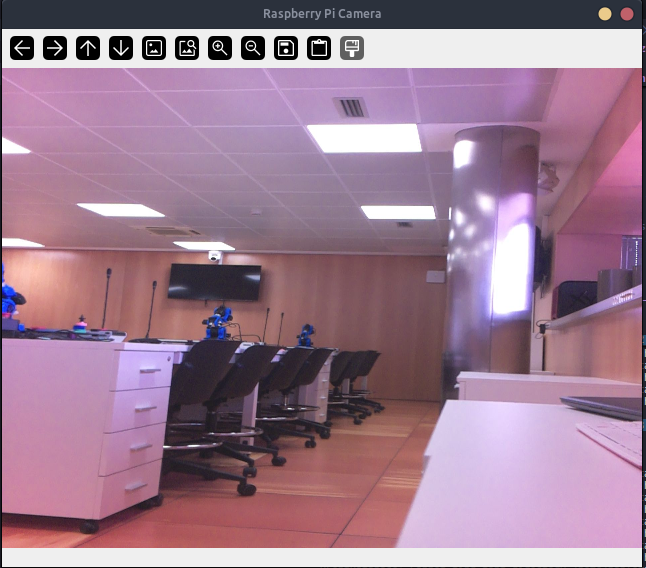

# Ejemplos de `rpicam-tcpclient` - Aprendizaje progresivo

Los ejemplos están organizados por "niveles de dificultad" para facilitar un aprendizaje estructurado:

* 01_básico/        # Primeros pasos
* 02_intermedio/    # Análisis y exportación
* 03_avanzado/      # Procesamiento avanzado

**Antes de empezar**

1. Servidor corriendo: `sudo systemctl status camara-tcp.service`
2. Instalación: `pip install -e .`
3. Probar conexión básica: `python examples/01_basico/mostrar_video.py --host <Raspberry_Pi_IP>`

---

## `01_basico/` - Primeros pasos

### 1. `mostrar_video.py` - Tu primera imagen

**Objetivo:** Ver video en tiempo real desde la Raspberry Pi usando valores por defecto

**¿Qué aprenderás?**

- Conectar con 'CameraClient'
- Bucle de recepción de frames
- Mostrar con OpenCV

**Uso:**

```bash
python mostrar_video.py --host <Raspberry_Pi_IP>
```

**Salida esperada**

```text
Conectado a la cámara en 172.16.127.78:5001
    Parámetros enviados: ninguno (valores por defecto)
Recibiendo video. Pulsa q para salir.
```



**Controles**

`q` para cerrar la ventana y finalizar la ejecución del script.


### 2. `mostrar_video_configurado.py` - Configuración desde el cliente

**Objetivo:** Personalizar la cámara (resolución, brillo, rotación, etc.)

**¿Qué aprenderás?**

- Todos los parámetro de 'CameraClient'
- Escalado y rotación local
- Uso de `--help` completo con `argparse`

**Uso:**

```bash
# Resolución reducida + saturación baja
python mostrar_video_configurado.py --host <Raspberry_Pi_IP> --width 640 --height 480 --saturation 0.6

# Rotación + contraste alto
python mostrar_video_configurado.py --host <Raspberry_Pi_IP> --rotation 180 --contrast 1.2

# Ejemplo de uso completo de los parámetros
python mostrar_video_configurado.py --host <Raspberry_Pi_IP> --width 640 --height 480 --saturation 0.6 --brightness 0.1 --rotation 180
```

**Parámetros disponibles:**

| Arg | Tipo | Rango | Dónde se aplica | Descripción |
|-----|------|-------|-----------------|-------------|
| `--width` | `int` | 64-1920 | **Cliente** | Ancho destino (`cv2.resize`) |
| `--height` | `int` | 64-1080 | **Cliente** | Alto destino (`cv2.resize`) |
| `--jpeg_quality` | `int` | 0-100 | **Servidor** | Calidad JPEG |
| `--brightness` | `float` | -1.0 a 1.0 | **Servidor** | Brillo (picamera2) |
| `--contrast` | `float` | 0.0-32.0 | **Servidor** | Contraste (picamera2) |
| `--saturation` | `float` | 0.0-32.0 | **Servidor** | Saturación (0.0=gris) |
| `--sharpness` | `float` | 0.0-16.0 | **Servidor** | Nitidez (picamera2) |
| `--exposure_time` | `int` | 114-694267 µs | **Servidor** | Exposición manual |
| `--analogue_gain` | `float` | 1.0-16.0 | **Servidor** | Ganancia analógica |
| `--rotation` | `int` | 0,90,180,270 | **Cliente** | Rotación (`cv2.rotate`) |

**Salida esperada:**

```text
Conectado a la cámara en 172.16.127.78:5001
  Parámetros enviados: {'saturation': 0.6}
```



**Controles:**

`q` para cerrar la ventana y finalizar la ejecución del script.

### 3. `guardar_frame.py` - Capturar y guardar una fotografía

**Objetivo:** Capturar un solo frame desde la Rapsberry Pi y guardarlo como imagen JPG en el ordenador remoto.

**¿Qué aprenderás?**

* Uso mínimo de `CameraClient` con context `with`.

* Cómo obtener un frame con `get_frame()` sin bucle de video.

* Guardar imágenes con OpenCV (`cv2.imwrite`).

* Comprobar el efecto de `width`, `height` y `rotation` locales.

**Uso:**

```bash
# Ejemplo básico: usar valores por defecto
python guardar_frame.py --host <Raspberry_Pi_IP>

# Guardar con nombre personalizado
python guardar_frame.py --host <Raspberry_Pi_IP> --output foto.jpg

# Escalado local a 640x480
python guardar_frame.py --host <Raspberry_Pi_IP> --width 640 --height 480 --output captura_640x480.jpg

# Rotación 90° + brillo configurado en el servidor
python guardar_frame.py --host <Raspberry_Pi_IP> --rotation 90 --brightness 0.4 --output foto_rotada.jpg
```

Parámetros clave:

* `--host`: IP de la Raspberry Pi donde reside el servidor (obligatorio)

* `--port`: puerto TCP del servidor (por defecto 5001)

* `--output`: nombre del archivo JPG destino (por defecto `frame.jpg` o similar)

* `--width` / `--height`: Tamaño destino; se aplica solo en el cliente con `cv2.resize`.

* `jpeg-quality`, `brightness`: se envían al serivodr y afectan a la captura.

* `rotation`: rotación local en el cliente (0, 90, 180, 270)

**Salida esperada (ejemplo):**

```text
Conectando a cámara en 172.16.127.78:5001...
Conectado a la cámara en 172.16.127.78:5001
    Parámetros enviados: ninguno (valores por defecto)
Conectado. Capturando frame...
Frame capturado: 1920x1080 píxeles (rotation=0°, width=None, height=None)
Frame guardado: /ruta/completa/frame.jpg
Desconectado del servidor de la cámara
```

